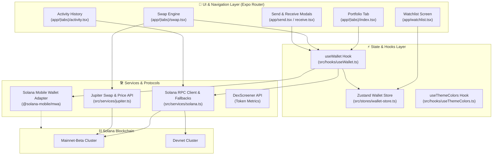

<div align="center">

  

  # ⚡ SolScan — Solana Mobile Wallet

  **A modern, non-custodial Solana mobile wallet & portfolio tracker built with Expo, React Native, and the Solana Mobile Wallet Adapter (MWA).**

  <p align="center">
    <a href="#-key-features">Features</a> •
    <a href="#-tech-stack">Tech Stack</a> •
    <a href="#-architecture">Architecture</a> •
    <a href="#-getting-started">Getting Started</a> •
    <a href="#-environment-variables">Configuration</a> •
    <a href="#-project-structure">Project Structure</a>
  </p>

  <p align="center">
    
    
    
    
    
    
  </p>

</div>

---

## 🌟 Overview

**SolScan** is a production-grade Web3 mobile application designed for the high-throughput Solana ecosystem. It combines the speed and security of the **Solana Mobile Stack (SMS)** with the agility of **Expo Router**, featuring seamless DEX swaps powered by **Jupiter**, multi-cluster support (Mainnet & Devnet), non-custodial wallet tracking, and a glassmorphic user interface.

Whether you are executing swaps, monitoring SPL token portfolios, exploring transaction histories, or tracking whale wallets in **Watch Mode**, SolScan provides a secure, intuitive, and responsive experience.

---

## ✨ Key Features

### 🔐 1. Non-Custodial & Secure Connectivity
- **Solana Mobile Wallet Adapter (MWA)**: Authorize sessions and sign transactions securely with native mobile wallets (Phantom, Solflare, Backpack) without exposing private keys.
- **Guest / Watch Mode**: Explore any public Solana wallet address, inspect token balances, and monitor activity without connecting a signer.
- **Fail-safe Rehydration**: Zustand + AsyncStorage state persistence ensures instant startup while keeping active signer sessions ephemeral for security.

### 💱 2. Jupiter DEX Swap Engine
- **Ultra-Fast Token Swaps**: Integrated directly with Jupiter DEX Aggregator (v1/v6) for minimal slippage and best route discovery.
- **Multi-Endpoint Fallbacks**: Redundant route queries across Official, Lite, and Public Mirror endpoints for continuous uptime.
- **Dynamic Quotes & Slippage**: Real-time debounce quote fetching with automatic base/quote token flipping and fee estimation.

### 📊 3. Portfolio & Market Analytics
- **Live SPL Token Holdings**: Real-time balance calculations, USD conversions, and portfolio asset allocation.
- **Top Performers & Sparklines**: Interactive market cards showcasing trending Solana tokens (SOL, JUP, BONK, WIF, USDC) with real-time 24h price action curves.
- **DexScreener Deep Dive**: Comprehensive token metrics including FDV, Market Cap, 24h Volume, Liquidity, and direct block explorer links.

### 💸 4. Seamless Transfers & Receiving
- **Smart Recipient Parser**: Automatically detects and normalizes raw Base58 addresses, `solana:` URI schemes, and Solscan URLs.
- **Safety Reserve Calculations**: Automatic fee reservation prevents accidental account draining during MAX transfers.
- **Integrated QR Code Generator**: Native QR code renderer for instant peer-to-peer receiving with one-tap clipboard sharing.

### 🌐 5. Network & Explorer Flexibility
- **Instant Cluster Switching**: Seamlessly toggle between **Solana Mainnet-Beta** and **Devnet** with dedicated RPC failover clusters.
- **Filterable Activity Feed**: Chronological transaction history classified by Confirmed / Failed status with relative timestamps and Solscan deep links.
- **Watchlist & Address Book**: Save favorite wallets for quick monitoring with swipe-to-delete management.

### 🎨 6. Premium Glassmorphic UI/UX
- **Dual Themes (Dark & Light)**: High-contrast, accessibility-tested color palettes with tailored typography and subtle mesh gradients.
- **Fluid Micro-Interactions**: Powered by `react-native-reanimated` 4 and `react-native-gesture-handler` for 60/120 FPS animations.
- **Edge-to-Edge Floating Navigation**: Safe-area aware floating tab bar optimized for gesture navigation.

---

## 🏗️ Architecture & Data Flow



---

## 💻 Tech Stack

| Domain | Technology | Description |
|---|---|---|
| **Framework** | [Expo SDK 57](https://expo.dev) | Modern managed workflow with Native Prebuild support |
| **Runtime** | [React Native 0.86](https://reactnative.dev) | Powered by the New Architecture & Hermes engine |
| **Language** | [TypeScript 5.x](https://www.typescriptlang.org) | Strict type safety across components, stores, and RPC layers |
| **Navigation** | [Expo Router](https://docs.expo.dev/router/introduction/) | File-system based routing supporting modals & dynamic routes |
| **Web3 Core** | [@solana/web3.js](https://solana-labs.github.io/solana-web3.js/) | Solana JavaScript API for transactions & RPC queries |
| **Wallet Protocol**| [@solana-mobile/mwa](https://github.com/solana-mobile/mobile-wallet-adapter) | Mobile Wallet Adapter for native wallet signing |
| **DEX Aggregation**| [Jupiter v6 API](https://jup.ag) | Best-route swap quoting and transaction building |
| **State Management**| [Zustand 5.x](https://github.com/pmndrs/zustand) | Lightweight, persistent state with AsyncStorage middleware |
| **Animations** | [Reanimated 4](https://docs.swmansion.com/react-native-reanimated/) | High-performance 60fps native-driven UI animations |
| **Styling** | Custom Design System | Dynamic theme tokens, glassmorphism, atmosphere backgrounds |

---

## 📁 Project Structure

```text
Solana-mobile-wallet/
├── app/                          # Expo Router File-Based Navigation
│   ├── (tabs)/                   # Bottom Tab Navigator Screens
│   │   ├── _layout.tsx           # Floating Tab Bar & Navigation Config
│   │   ├── index.tsx             # Portfolio Overview & Top Performers
│   │   ├── swap.tsx              # Jupiter DEX Swap Interface
│   │   ├── activity.tsx          # On-Chain Transaction History
│   │   └── settings.tsx          # Preferences, Network & Wallet Profile
│   ├── token/
│   │   └── [mint].tsx            # Dynamic Token Deep-Dive & Market Stats
│   ├── _layout.tsx               # Root Stack, Polyfills & Gesture Provider
│   ├── send.tsx                  # Send SOL/SPL Token Modal
│   ├── receive.tsx               # Receive Address & QR Code Modal
│   └── watchlist.tsx             # Saved Wallets & Watch Mode Explorer
├── src/
│   ├── components/               # Reusable UI Components
│   │   ├── ConnectButton.tsx     # Animated MWA Connect / Disconnect Action
│   │   ├── QRCode.tsx            # Custom QR Code Matrix Renderer
│   │   ├── ScreenAtmosphere.tsx  # Dynamic Ambient Gradient Mesh
│   │   ├── SwipeableHistoryItem  # Gesture-driven History Item
│   │   └── MoonpayBackdrop.tsx   # Visual Backdrop Helper
│   ├── constants/
│   │   └── theme.ts              # Strict Color Tokens (Light & Dark)
│   ├── hooks/
│   │   ├── useWallet.ts          # Complete MWA + Web3.js Bridge Hook
│   │   └── useThemeColors.ts     # Active Theme Palette Provider
│   ├── lib/
│   │   ├── clipboard.ts          # Cross-platform Safe Clipboard Copy
│   │   └── qrcode.ts             # Lightweight QR Matrix Generator
│   ├── polyfills.ts              # Crypto, Buffer & TurboModule Fallbacks
│   ├── services/
│   │   ├── jupiter.ts            # Jupiter Quoting & Swap Execution Service
│   │   └── solana.ts             # Redundant RPC Client with Auto-Failover
│   ├── stores/
│   │   └── wallet-store.ts       # Zustand Store with Storage Persistence
│   └── utils/
│       └── helpers.ts            # Formatting, Balance, & Explorer Helpers
├── ios/                          # Native iOS Project (Xcode / CocoaPods)
├── android/                      # Native Android Project (Gradle / Kotlin)
├── app.json                      # Expo Project Configuration & Plugins
├── package.json                  # Dependencies & Scripts
└── tsconfig.json                 # TypeScript Configuration
```

---

## 🚀 Getting Started

### Prerequisites

Ensure your development environment is set up with the following:
- **Node.js**: `v20.x` or higher (LTS recommended)
- **Package Manager**: `npm`, `yarn`, or `bun`
- **For iOS**: macOS with **Xcode 16+** and **CocoaPods** (`gem install cocoapods`)
- **For Android**: **Android Studio** with SDK Platform 34+ and an active emulator or physical device

---

### 📥 1. Clone & Install Dependencies

```bash
# Clone the repository
git clone https://github.com/rishabhvyass/Solana-mobile-wallet.git
cd Solana-mobile-wallet

# Install project dependencies
npm install
# or
bun install
```

---

### ⚙️ 2. Environment Configuration

Create a `.env` file in the root directory:

```env
# Primary Solana RPC Endpoints
EXPO_PUBLIC_RPC="https://api.mainnet-beta.solana.com"
EXPO_PUBLIC_DEV_RPC="https://api.devnet.solana.com"

# Optional: Redundant RPC Fallbacks (comma or newline separated)
EXPO_PUBLIC_RPC_FALLBACKS="https://solana-rpc.publicnode.com"

# Standard SPL Token Program ID
EXPO_PUBLIC_PROGRAM_ID="TokenkegQfeZyiNwAJbNbGKPFXCWuBvf9Ss623VQ5DA"

# Optional: Jupiter API Key (for higher rate limits on official endpoint)
EXPO_PUBLIC_JUPITER_API_KEY=""
```

---

### 📱 3. Running the App

#### **iOS (Simulator or Device)**
```bash
# Run on iOS Simulator (Requires iOS 16.4+ deployment target)
npx expo run:ios
```

#### **Android (Emulator or Device)**
```bash
# Run on Android Device / Emulator
npx expo run:android
```

#### **Web Preview**
```bash
npx expo start --web
```

> [!TIP]
> **Mobile Wallet Adapter (MWA)** requires a native development build (`expo run:android` or `expo run:ios`) or a physical device with a supported wallet installed (Phantom, Solflare, etc.). It cannot sign transactions inside standard Expo Go.

---

## 🛡️ Security & Polyfills

React Native environments lack certain Node.js primitives required by cryptographic libraries (`@solana/web3.js`, `tweetnacl`, `bs58`). SolScan initializes comprehensive polyfills in [`src/polyfills.ts`](./src/polyfills.ts) before any application code executes:

- **`Buffer`**: Global polyfill for binary serialization.
- **`crypto.getRandomValues`**: Native entropy using `expo-crypto`.
- **`btoa` / `atob`**: Binary string encoding and decoding.
- **TurboModule Fallback**: Graceful handling for missing native MWA bindings during non-native or preview execution.

---

## 🧪 Quality & Verification Commands

```bash
# TypeScript Type Checking
npm run typecheck

# Linting
npm run lint

# Start Metro Bundler with cache reset
npx expo start -c
```

---

## 🤝 Contributing

Contributions are welcome! If you'd like to improve SolScan:

1. **Fork the Repository**
2. **Create your Feature Branch** (`git checkout -b feature/AmazingFeature`)
3. **Commit your Changes** (`git commit -m 'feat: Add AmazingFeature'`)
4. **Push to the Branch** (`git push origin feature/AmazingFeature`)
5. **Open a Pull Request**

---

## 📄 License

This project is licensed under the **MIT License** — see the [LICENSE](LICENSE) file for details.

---

<div align="center">
  <sub>Built with ❤️ for the Solana Community by <a href="https://github.com/rishabhvyass">Rishabh Vyas</a></sub>
</div>